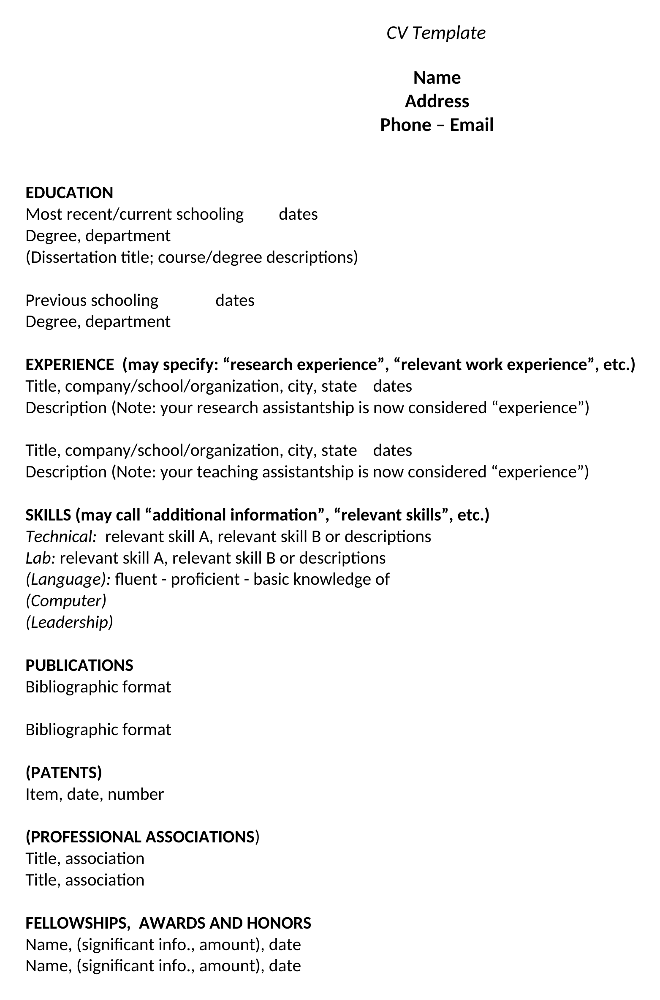
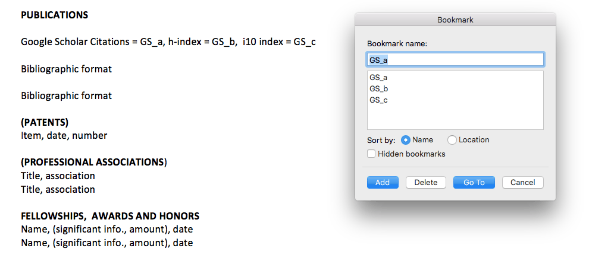
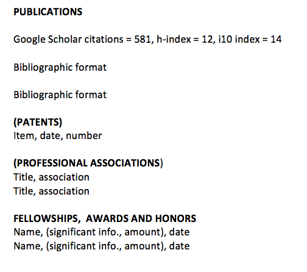
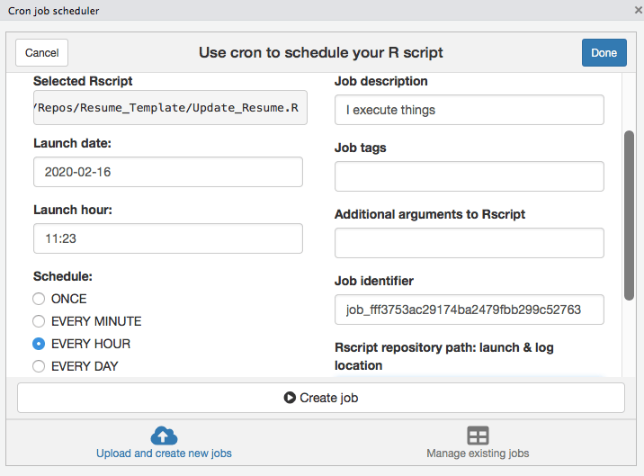

*Updated on October 4, 2026. The script can now be copied straight from this page, it falls back on saved numbers when Google Scholar does not answer, the links are refreshed, and there is a new section on doing all of this with Claude.*

The inspiration behind this post comes from my non-computational scientist colleagues who simply wanted to import [Google Scholar](https://en.wikipedia.org/wiki/Google_Scholar) citation metrics in their CVs and resumes with as little overhead as possible. After a few quick searches, several solutions popped up that used either [Markdown](https://en.wikipedia.org/wiki/Markdown) or [LaTeX](https://en.wikipedia.org/wiki/LaTeX). While I appreciate these more sophisticated maneuvers, they did not serve any useful purpose for my specific motivation as described below.

## Motivation

There are just a few things my scientist colleagues wanted to achieve:

1.  Ability to edit their CVs and resumes in Microsoft Word,
2.  Without the need to learn a new language or markup syntax, and
3.  Without falling back to a manual update which can be inconvenient.

Fortunately, the [R community](https://blog.revolutionanalytics.com/2017/06/r-community.html) has already done much of the hard work, thanks to the awesome [`officer`](https://cran.r-project.org/package=officer) and [`scholar`](https://cran.r-project.org/package=scholar) packages. Briefly, the `officer` package lets users manipulate Word documents without altering the contents, styles, and properties of the original document, while the `scholar` package provides handy functions to extract citation data from Google Scholar.

Among other things, I wanted this solution to be a bit more robust without being too complicated for future expansion. In particular, the possibility of adding other elements above and beyond citation metrics such as images, tables, and text from R as well as portability to other documents such as PowerPoint (\*.pptx) was on the top of my list. Beyond everything, I wanted to make this exercise as seamless and efficient as possible for my scientist colleagues irrespective of their coding background.

Before getting started, here are a few things we will need: (i) A CV or resume written in Word (.docx), (ii) [R](https://cran.r-project.org/), and (iii) [RStudio](https://posit.co/download/rstudio-desktop/) (both are free, and the RStudio page walks you through installing them). This tutorial also assumes that you have an up-to-date [Google Scholar](https://scholar.google.com/) profile. All files described in this tutorial are [publicly available](https://github.com/himelmallick/himelmallick.github.io/tree/master/post/automate_citation_metrics_resume).

So, here goes the simple 3-step solution.

## Step 1: Customizing the Word Document

For illustration purposes, I will use a template resume named `Resume_Master.docx` which is mostly empty at this point:

{width=470 fig-alt="The blank CV template used in this tutorial"}

The first step is to add a bookmark where you want to insert your citation metrics. If you are unfamiliar with bookmarks in Word documents, I suggest reading the [Microsoft Office tutorial](https://support.microsoft.com/en-us/office/add-or-delete-bookmarks-in-a-word-document-or-outlook-message-f68d781f-0150-4583-a90e-a4009d99c2a0) which is pretty concise and hence skipped here. For our specific task, I want to define three bookmarks right after the `Publications` section as follows:

{fig-alt="Word bookmark dialog listing the bookmarks GS_a, GS_b and GS_c placed after the Publications heading"}

In particular, I intend to import total citation counts, h-index, and i10 index on these pre-defined bookmarks `GS_a`, `GS_b`, and `GS_c` respectively, as verified by the bookmark window on the right.

## Step 2: Running a minimal R script

This step is actually pretty simple as long as you know [how to run a script in RStudio](https://www.dummies.com/programming/r/how-to-source-a-script-in-r/) (open the file and click `Source`). Here is the bare minimum script (`Update_Resume.R`):

```r
scholar_id  <- "twbXG-wAAAAJ"        # the id in the address of your Google Scholar profile
input_file  <- "Resume_Master.docx"  # the resume you edit
output_file <- "Resume_Final.docx"   # the copy with the numbers filled in

for (pkg in c("officer", "scholar")) {
  if (!requireNamespace(pkg, quietly = TRUE)) install.packages(pkg)
}

# 1. Get the numbers. If Google Scholar does not answer, reuse the last saved ones.
saved <- "scholar_metrics.rds"
profile <- tryCatch(scholar::get_profile(scholar_id), error = function(e) NULL)
answered <- is.list(profile) && length(profile$total_cites) == 1 && !is.na(profile$total_cites)

if (answered) {
  metrics <- c(GS_a = profile$total_cites, GS_b = profile$h_index, GS_c = profile$i10_index)
  saveRDS(metrics, saved)
} else if (file.exists(saved)) {
  metrics <- readRDS(saved)
  message("Google Scholar did not answer. Using the numbers saved on ",
          format(file.mtime(saved), "%B %d, %Y"), ".")
} else {
  stop("Google Scholar did not answer and there are no saved numbers yet. Try again later.")
}

# 2. Write them at the bookmarks GS_a, GS_b and GS_c.
doc <- officer::read_docx(input_file)
absent <- setdiff(names(metrics), officer::docx_bookmarks(doc))
if (length(absent) > 0) {
  stop("Add these bookmarks to ", input_file, " first: ", paste(absent, collapse = ", "))
}
for (bookmark in names(metrics)) {
  number <- format(metrics[[bookmark]], big.mark = ",")
  doc <- officer::body_replace_text_at_bkm(doc, bookmark, number)
}
print(doc, target = output_file)
message("Wrote ", output_file)
```

A quick breakdown of what it does is as follows. First, it installs the required packages if they are missing. In the second chunk of the code, it extracts the relevant Google Scholar citation metrics (make sure you have an internet connection while executing this part). Here I have used my own Google Scholar ID `twbXG-wAAAAJ` (don't forget to change to yours). Finally, it inserts these metrics into your input Word document (in this case `Resume_Master.docx`) and outputs an updated document called `Resume_Final.docx`.

Two things are new in the 2026 version of the script. Google Scholar sometimes refuses automated requests for a few hours, so the script keeps a copy of the last numbers it received (`scholar_metrics.rds`) and uses that copy on such days. It also checks that the three bookmarks exist and tells you which one is missing.

With my own humble contribution to science, the resulting file looks something like this (numbers retrieved on October 4, 2026):

{width=520 fig-alt="Updated resume showing Google Scholar citations = 13,040, h-index = 26, i10 index = 38"}

When this post first appeared in February 2020, the same line read `citations = 581, h-index = 12, i10 index = 14`.

Please note that, this script assumes that all the associated files are co-located in the same directory. Please make sure to change the names of your input and output files in the first three lines as desired before executing.

The cool thing is that you can seamlessly edit your master file as you would normally do and run this script as frequently as you want to get the citations metrics inserted automatically.

That's it! You have the exact same resume with the citation metrics inserted.

## (Optional) Step 3: Automating with cron

Now, if you would like to further fine-tune this process [without the hassle of running the script every other day](https://ideophone.org/how-often-does-google-scholar-update/), you can optionally do that thanks to the amazing [`cronR`](https://cran.r-project.org/package=cronR) package (Mac and Linux; on Windows the sister package [`taskscheduleR`](https://cran.r-project.org/package=taskscheduleR) does the same job). Fortunately, this step is dead easy as well, especially if you are already familiar with R.

In particular, once you are able to install the `cronR` package following instructions [here](https://github.com/bnosac/cronR), you can jump right into the `RStudio add-in` section of that tutorial.

As an example, if you want to execute the `Update_Resume.R` script hourly, all you have to do is the following before pressing the `Create job` button:

{fig-alt="cronR add-in in RStudio scheduling the R script to run every hour"}

Once you schedule the job above, it will update every hour whenever your computer is switched on (you can change the schedule any time). Citation counts change slowly, so a daily or weekly schedule is plenty, and a gentler schedule also makes it less likely that Google Scholar turns your requests away. You can also save the resulting file in a shared or publicly accessible folder (such as Dropbox, Google Drive, and OneDrive) and easily embed it on your personal website if you would like.

## Doing this with Claude (new in 2026)

When I wrote this post in 2020, the three steps above were the shortest path I could offer a colleague who does not code. In 2026 there is a shorter one: hand the job to an AI assistant. I use [Claude](https://claude.com), and the prompts below are the ones I would give a colleague today. Attach your resume and send them one at a time.

**1. Set it up.**

```
Attached is my resume in Word. I want my Google Scholar citation count, h-index
and i10-index to appear on one line under the Publications heading and to update
automatically. My Google Scholar profile is <paste the address of your profile>.
Add the three bookmarks to the document for me, write an R script that fills
them in with the officer and scholar packages, and tell me step by step how to
run it in RStudio. I have never used R.
```

**2. Make it sturdy.**

```
Google Scholar sometimes refuses automated requests. Change the script so that
it saves the last numbers it received and uses them when a request fails, and
so that it tells me in plain words when a bookmark is missing.
```

**3. Put it on a schedule.**

```
I use a <Mac / Windows PC>. Give me the exact steps to run this script once a
week without opening RStudio.
```

Three pieces of advice from doing this myself:

- **Ask Claude for the code, and let the code fetch the numbers.** A language model's memory of your citation count was already out of date on the day it was trained. The script asks Google Scholar every time.
- **Expect to run the script on your own computer.** Claude's cloud workspace could not reach Google Scholar when I tried, and the first real numbers arrived when the script ran on my own machine.
- **Check the first result against your profile.** It takes ten seconds, and after that the script has earned your trust.

The same approach carries over to LaTeX and Quarto documents, including a citation count next to each paper. That is the subject of [Part II](../automate_citation_metrics_resume_2/index.qmd).

Happy automating! It's not that difficult after all :)
