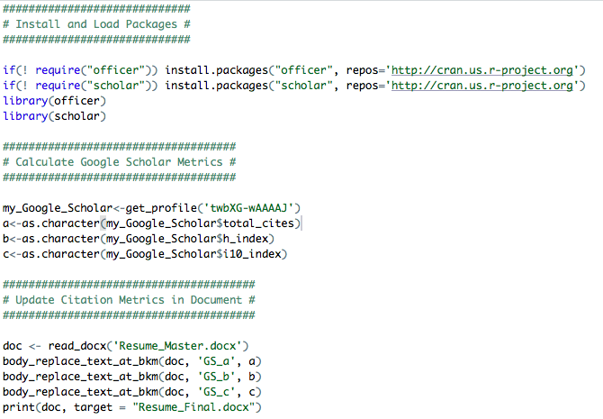

The inspiration behind this post comes from my non-computational scientist colleagues who simply wanted to import [Google Scholar](https://en.wikipedia.org/wiki/Google_Scholar) citation metrics in their CVs and resumes with as little overhead as possible. After a few quick searches, several solutions popped up that used either [Markdown](https://en.wikipedia.org/wiki/Markdown) or [LaTeX](https://en.wikipedia.org/wiki/LaTeX). While I appreciate these more sophisticated maneuvers, they did not serve any useful purpose for my specific motivation as described below.

## Motivation

There are just a few things my scientist colleagues wanted to achieve:

1.  Ability to edit their CVs and resumes in Microsoft Word,
2.  Without the need to learn a new language or markup syntax, and
3.  Without falling back to a manual update which can be inconvenient.

Fortunately, the [R community](https://blog.revolutionanalytics.com/2017/06/r-community.html) has already done much of the hard work, thanks to the awesome [`officer`](https://cran.r-project.org/web/packages/officer) and [`scholar`](https://cran.r-project.org/web/packages/scholar) packages. Briefly, the `officer` package lets users manipulate Word documents without altering the contents, styles, and properties of the original document, while the `scholar` package provides handy functions to extract citation data from Google Scholar.

Among other things, I wanted this solution to be a bit more robust without being too complicated for future expansion. In particular, the possibility of adding other elements above and beyond citation metrics such as images, tables, and text from R as well as portability to other documents such as PowerPoint (\*.pptx) was on the top of my list. Beyond everything, I wanted to make this exercise as seamless and efficient as possible for my scientist colleagues irrespective of their coding background.

Before getting started, here are a few things we will need: (i) A CV or resume written in Word (.docx), (ii) [R](https://cran.r-project.org/), and (iii) [RStudio](https://rstudio.com/). Information about installing R and RStudio is [here](https://courses.edx.org/courses/UTAustinX/UT.7.01x/3T2014/56c5437b88fa43cf828bff5371c6a924/) (it's free!). This tutorial also assumes that you have an up-to-date [Google Scholar](https://scholar.google.com/) profile. All files described in this tutorial are [publicly available](https://github.com/himelmallick/himelmallick.github.io/tree/master/post/automate_citation_metrics_resume).

So, here goes the simple 3-step solution.

## Step 1: Customizing the Word Document

For illustration purposes, I will use a template resume named `Resume_Master.docx` which is mostly empty at this point:

{fig-alt="A blank CV template opened in Microsoft Word"}

The first step is to add a bookmark where you want to insert your citation metrics. If you are unfamiliar with bookmarks in Word documents, I suggest reading the [Microsoft Office tutorial](https://support.office.com/en-us/article/add-or-delete-bookmarks-in-a-word-document-or-outlook-message-f68d781f-0150-4583-a90e-a4009d99c2a0) which is pretty concise and hence skipped here. For our specific task, I want to define three bookmarks right after the `Publications` section as follows:

{fig-alt="Word bookmark dialog listing the bookmarks GS_a, GS_b and GS_c placed after the Publications heading"}

In particular, I intend to import total citation counts, h-index, and i10 index on these pre-defined bookmarks `GS_a`, `GS_b`, and `GS_c` respectively, as verified by the bookmark window on the right.

## Step 2: Running a minimal R script

This step is actually pretty simple as long as you know [how to run a script in RStudio](https://www.dummies.com/programming/r/how-to-source-a-script-in-r/). A quick breakdown of what this bare minimum script (`Update_Resume.R`) does is as follows.

{fig-alt="R script that loads the officer and scholar packages, retrieves the Google Scholar metrics and writes them into the Word document"}

First, it installs and loads the required packages. In the second chunk of the code, it extracts the relevant Google Scholar citation metrics (make sure you have an internet connection while executing this part). Here I have used my own Google Scholar ID `twbXG-wAAAAJ` (don't forget to change to yours). Finally, it inserts these metrics into your input Word Document (in this case `Resume_Master.docx`) and outputs an updated document called `Resume_Final.docx`. With my own humble contribution to science, the resulting file looks something like this (last retrieved on February 16, 2020):

{fig-alt="Updated resume showing Google Scholar citations = 581, h-index = 12, i10 index = 14"}

Please note that, this script assumes that all the associated files are co-located in the same directory. Please make sure to change the names of your input and output files in this script as desired before executing.

The cool thing is that you can seamlessly edit your master file as you would normally do and run this script as frequently as you want to get the citations metrics inserted automatically.

That's it! You have the exact same resume with the citation metrics inserted.

## (Optional) Step 3: Automating with cron

Now, if you would like to further fine-tune this process [without the hassle of running the script every other day](http://ideophone.org/how-often-does-google-scholar-update/), you can optionally do that thanks to the amazing [`cronR`](https://cran.r-project.org/web/packages/cronR) package. Fortunately, this step is dead easy as well, especially if you are already familar with R.

In particular, once you are able to install the `cronR` package following instructions [here](https://github.com/bnosac/cronR), you can jump right into the `RStudio add-in` section of that tutorial.

As an example, if you want to execute the `Update_Resume.R` script hourly, all you have to do is the following before pressing the `Create job` button:

{fig-alt="cronR add-in in RStudio scheduling the R script to run every hour"}

Once you schedule the job above, it will update every hour whenever your computer is switched on (you can change the schedule any time). You can also save the resulting file in a shared or publicly accessible folder (such as Dropbox, Google Drive, and OneDrive) and easily embed it on your personal website if you would like.

Happy automating! It's not that difficult after all :)
