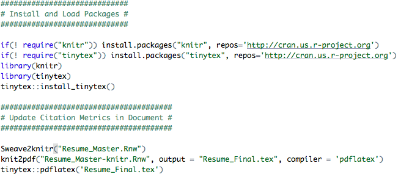

Following my previous post ([Part I](https://himelmallick.github.io/post/automate_citation_metrics_resume/)), I received a few requests from my fellow mathematical and physical scientist colleagues who prepare their CVs and resumes in the popular typesetting system [LaTeX](https://en.wikipedia.org/wiki/LaTeX). In this post, I will go over the steps required to automatically import Google Scholar citation metrics in a LaTeX document without any hassle or compromise.

## Motivation

Similar to [Part I](https://himelmallick.github.io/post/automate_citation_metrics_resume/), here are just a few things I would like to maintain:

1.  Ability to edit CVs and resumes in LaTeX,
2.  Without the need to learn a new language or markup syntax, and
3.  Without falling back to a manual update which can be inconvenient.

As before, here are a few things we will need: (i) A CV or resume written in LaTeX (.tex), (ii) [R](https://cran.r-project.org/), and (iii) [RStudio](https://rstudio.com/). Information about installing R and RStudio is [here](https://courses.edx.org/courses/UTAustinX/UT.7.01x/3T2014/56c5437b88fa43cf828bff5371c6a924/) (it's free!). This tutorial also assumes that you have an up-to-date [Google Scholar](https://scholar.google.com/) profile. All files described in this tutorial are [publicly available](https://github.com/himelmallick/himelmallick.github.io/tree/master/post/automate_citation_metrics_resume_2).

Compared to the previous post, this tutorial is more straightforward, thanks to the well-developed [Sweave function](https://en.wikipedia.org/wiki/Sweave), that enables effortless integration of R code into LaTeX documents, allowing one to execute and embed the results of R computations and graphics within a LaTeX document.

Without further ado, here goes the quick 3-step solution.

## Step 1: Customizing the LaTeX Document

First step is to convert the existing LaTeX (.tex) document into a Sweave file (.Rnw) by simply changing the extension.

## Step 2: Adding a minimal R code

Next, add the following R chunk in your `.Rnw` document (anywhere between `\begin{document}` and `\end{document}`):

```r
<<echo=FALSE>>=
library(scholar)
my_Google_Scholar<-get_profile('twbXG-wAAAAJ')
a<-my_Google_Scholar$total_cites
b<-my_Google_Scholar$h_index
c<-my_Google_Scholar$i10_index
@
```

In the above code, I have used my own Google Scholar ID `twbXG-wAAAAJ`. Please don't forget to modify to yours. You also need to call out these extracted values (`a`, `b`, and `c`) using the `\Sexpr` command in the LaTeX document as follows:

```
Citations = \Sexpr{a}
h-index = \Sexpr{b}
i-10 index = \Sexpr{c}
```

That's it. Now you can compile this file directly from RStudio by simply executing the `Compile PDF` button on the right:

{fig-alt="RStudio editor showing the Sweave chunk, the Sexpr calls and the Compile PDF button"}

For your reference, the snapshot above is from my own resume which can be downloaded from [here](http://himelmallick.org/).

## (Optional) Step 3: Automating with cron

Once the Steps 1 and 2 are in place, it's as easy as pie to automate this further. In particular, you can follow the exact same steps from [Part I](https://himelmallick.github.io/post/automate_citation_metrics_resume/) tutorial to set up a cron job, with a few ramifications, as detailed below.

{fig-alt="R script that loads knitr and tinytex, runs Sweave2knitr and compiles the document to PDF"}

The code above assumes that `Resume_Master` is the master file that you intend to update and `Resume_Final` is the final document, whereas the `Resume_Master-knitr` is an intermediate file. After you execute these steps, a PDF named `Resume_Final.pdf` with the appended Google Scholar citation metrics will be produced.

I have not tested the above code chunk myself but please feel free to relay any comments, suggestions, or corrections my way if you encounter any issues.

Happy Tuesday! I hope you find this tutorial useful :)
