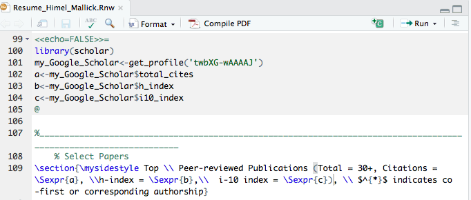
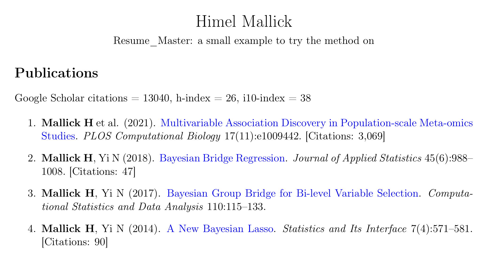

*Updated on October 4, 2026. The Sweave steps now come with a small example you can run, there is a second route through Quarto that also puts a citation count next to each paper, the automation script has been replaced with one that has been run, and there is a new section on doing all of this with Claude.*

Following my previous post ([Part I](../automate_citation_metrics_resume/index.qmd)), I received a few requests from my fellow mathematical and physical scientist colleagues who prepare their CVs and resumes in the popular typesetting system [LaTeX](https://en.wikipedia.org/wiki/LaTeX). In this post, I will go over the steps required to automatically import Google Scholar citation metrics in a LaTeX document without any hassle or compromise.

## Motivation

Similar to [Part I](../automate_citation_metrics_resume/index.qmd), here are just a few things I would like to maintain:

1.  Ability to edit CVs and resumes in LaTeX,
2.  Without the need to learn a new language or markup syntax, and
3.  Without falling back to a manual update which can be inconvenient.

As before, here are a few things we will need: (i) A CV or resume written in LaTeX (.tex), (ii) [R](https://cran.r-project.org/), and (iii) [RStudio](https://posit.co/download/rstudio-desktop/) (both are free, and the RStudio page walks you through installing them). This tutorial also assumes that you have an up-to-date [Google Scholar](https://scholar.google.com/) profile. All files described in this tutorial, including a small example resume for each route, are [publicly available](https://github.com/himelmallick/himelmallick.github.io/tree/master/post/automate_citation_metrics_resume_2).

Compared to the previous post, this tutorial is more straightforward, thanks to the well-developed [Sweave function](https://en.wikipedia.org/wiki/Sweave), that enables effortless integration of R code into LaTeX documents, allowing one to execute and embed the results of R computations and graphics within a LaTeX document.

Without further ado, here goes the quick 3-step solution.

## Step 1: Customizing the LaTeX Document

First step is to convert the existing LaTeX (.tex) document into a Sweave file (.Rnw) by simply changing the extension.

## Step 2: Adding a minimal R code

Next, add the following R chunk in your `.Rnw` document (anywhere between `\begin{document}` and `\end{document}`):

```r
<<echo=FALSE>>=
library(scholar)
my_Google_Scholar<-get_profile('twbXG-wAAAAJ')
a<-my_Google_Scholar$total_cites
b<-my_Google_Scholar$h_index
c<-my_Google_Scholar$i10_index
@
```

In the above code, I have used my own Google Scholar ID `twbXG-wAAAAJ`. Please don't forget to modify to yours. You also need to call out these extracted values (`a`, `b`, and `c`) using the `\Sexpr` command in the LaTeX document as follows:

```
Citations = \Sexpr{a}
h-index = \Sexpr{b}
i-10 index = \Sexpr{c}
```

That's it. Now you can compile this file directly from RStudio by simply executing the `Compile PDF` button on the right:

{fig-alt="RStudio editor showing the Sweave chunk, the Sexpr calls and the Compile PDF button"}

For your reference, the snapshot above is from my own resume which can be downloaded from [here](../../index.qmd).

One caveat I have learned since 2020: Google Scholar sometimes refuses automated requests for a few hours, and on such days the chunk above stops the whole document from compiling. A slightly longer chunk keeps a copy of the last numbers it received and uses that copy when a request fails:

```r
<<echo=FALSE>>=
library(scholar)
saved <- "scholar_metrics.rds"
gs <- tryCatch(get_profile("twbXG-wAAAAJ"), error = function(e) NULL)
if (is.list(gs) && !is.na(gs$total_cites)) saveRDS(gs, saved) else gs <- readRDS(saved)
a <- gs$total_cites
b <- gs$h_index
c <- gs$i10_index
@
```

A complete small resume with this chunk is in the [`_example/sweave`](https://github.com/himelmallick/himelmallick.github.io/tree/master/post/automate_citation_metrics_resume_2/_example/sweave) folder.

## (Optional) Step 3: Automating with cron

Once the Steps 1 and 2 are in place, it's as easy as pie to automate this further. In particular, you can follow the exact same steps from [Part I](../automate_citation_metrics_resume/index.qmd) tutorial to set up a cron job, using the following script (`Update_Resume.R`) in place of the one from Part I:

```r
route <- "sweave"   # "sweave" or "quarto"

if (route == "sweave") {
  # Runs the R chunk, then LaTeX. Needs a LaTeX installation
  # (the quickest one to set up: install.packages("tinytex"); tinytex::install_tinytex()).
  utils::Sweave("Resume_Master.Rnw")
  tools::texi2pdf("Resume_Master.tex", clean = TRUE)
} else {
  # Needs Quarto (it comes with RStudio).
  status <- system2("quarto", c("render", "Resume_Master.qmd"))
  if (status != 0) stop("Quarto could not build the resume. Read the message above.")
}

invisible(file.copy("Resume_Master.pdf", "Resume_Final.pdf", overwrite = TRUE))
message("Wrote Resume_Final.pdf")
```

The code above assumes that `Resume_Master` is the master file that you intend to update and `Resume_Final` is the final document. After you execute these steps, a PDF named `Resume_Final.pdf` with the appended Google Scholar citation metrics will be produced. This script replaces the one in the 2020 version of this post, which I had not tested at the time. This one has been run on the example files for both routes.

## The Quarto route, with a citation count for each paper (new in 2026)

[Quarto](https://quarto.org) is the successor to the Sweave and R Markdown family, and in October 2026 I moved my own CV and resume to it. The idea is the same as before: your LaTeX stays LaTeX, and a few lines of R fetch the numbers each time the PDF is built. Two things get better. The build survives the days when Google Scholar does not answer, and each paper can carry its own citation count.

The [`_example/quarto`](https://github.com/himelmallick/himelmallick.github.io/tree/master/post/automate_citation_metrics_resume_2/_example/quarto) folder has three small files:

- `Resume_Master.qmd`: the text of the resume, still in LaTeX
- `resume-template.latex`: the LaTeX preamble (everything above `\begin{document}`)
- `scholar.R`: the helper that talks to Google Scholar

To convert your own document, move your preamble into the template, and paste the rest between the two fences of the `{=latex}` block. The top of `Resume_Master.qmd` looks like this:

````
---
format:
  pdf:
    template: resume-template.latex
    pdf-engine: pdflatex
engine: knitr
---

```{{r}}
#| echo: false
source("scholar.R")
scholar_setup(
  id = "twbXG-wAAAAJ",                  # your Google Scholar profile
  min_citations = 30,                   # papers with at least this many citations show a count
  citation_format = "[Citations: %s]"   # how the count is written; %s is the number
)
```

```{=latex}
\section*{Publications}

Google Scholar citations = \GSCitations{}, h-index = \GSHIndex{}, i10-index = \GSIIndex{}

\begin{enumerate}
%% citation counts: on
\item \textbf{Mallick H}, Yi N (2014). \href{https://www.ncbi.nlm.nih.gov/pubmed/27570577}{A New Bayesian Lasso}. \textit{Statistics and Its Interface} 7(4):571--581.
%% citation counts: off
\end{enumerate}
```
````

Three names replace the `\Sexpr` calls of the Sweave route: `\GSCitations{}`, `\GSHIndex{}` and `\GSIIndex{}`. Every paper between the two `%% citation counts` lines is looked up on your Google Scholar profile by its title (the text inside `\href{}{}`), and its count is added at the end of the entry when it reaches the threshold. Click `Render` in RStudio and you get this:

{fig-alt="Example resume produced by the Quarto route: Google Scholar totals under the Publications heading, and a citation count in square brackets after each paper with at least 30 citations"}

The third paper has fewer than 30 citations, so it shows no count. Change `min_citations` to move that line.

A few details that make this pleasant to live with:

- The numbers are saved in a small file (`scholar-cache.json`) after every successful request and reused for 12 hours, so building a CV and a resume one after the other asks Google Scholar once.
- When Google Scholar does not answer, the saved numbers are used and the build log says so, with their date.
- Titles are matched with some tolerance, since the same paper is often worded a little differently on Google Scholar. Running `scholar_check("Resume_Master.qmd")` in the R console lists the well-cited papers on your profile that matched nothing in the document, which is how I caught two papers whose titles differed.

## Doing this with Claude (new in 2026)

I did the conversion of my own 30-page CV with [Claude](https://claude.com). These are the prompts I would start from. Attach your `.tex` file (or point Claude at the folder) and send them one at a time.

**1. Convert, and prove that nothing changed.**

```
Attached is my CV in LaTeX. Convert it to a Quarto document that produces the
same PDF: keep my preamble in a template file and keep the text as LaTeX. Then
build both versions and confirm that the new PDF matches the old one word for
word, with the same number of pages and the same fonts.
```

**2. Add the totals.**

```
Show my Google Scholar citation count, h-index and i10-index in the heading of
the Publications section, fetched with the R scholar package each time the PDF
is built. My profile is <paste the address of your profile>. Save the numbers
after every successful request and fall back on them when Google Scholar does
not answer, so the document always builds.
```

**3. Add a count to each paper.**

```
After each paper with at least 30 citations, add its Google Scholar count as
[Citations: N]. Match papers by title, allow for small differences in wording,
and give me a list of the papers on my profile that you could not match.
```

**4. Put it on a schedule.**

```
I use a <Mac / Windows PC>. Give me the exact steps to rebuild the PDF once a
week and save it to my Dropbox folder under the same file name.
```

Three pieces of advice from doing this myself:

- **Ask for the comparison in the first prompt.** "Matches word for word" is a claim that a program can check, and that check is what makes a 30-page conversion trustworthy without rereading every line.
- **Expect the first real numbers to arrive on your own computer.** Claude's cloud workspace could not reach Google Scholar when I tried. The matching was tested there on made-up numbers, and the real ones came in the first time I rendered the document myself.
- **Read the list of unmatched papers.** Mine had three entries. Two were my own papers under slightly different titles, which a looser match fixed. The third was a book I had contributed a chapter to, which is a judgment call a script should leave to you.

Happy Tuesday! I hope you find this tutorial useful :)
