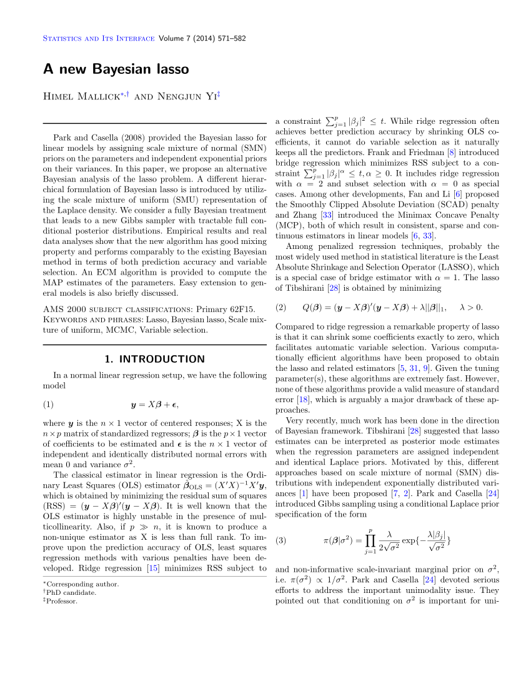

*Note: the figure above was regenerated on October 4, 2026. It now runs through 2025 and uses Google Scholar's yearly citation counts as they are, self-citations included. The text below is unchanged from 2020.*

This 15th August marked 7 years since I submitted my [first paper](https://www.intlpress.com/site/pub/pages/journals/items/sii/content/vols/0007/0004/a012/) (first-authored research article). Coincidentally, it also completed five calendar years last December, which gave me a chance to measure it's [5-year impact](https://support.clarivate.com/ScientificandAcademicResearch/s/article/Journal-Citation-Reports-5-Year-Impact-Factors?language=en_US) (erring on the conservative side of course).

I am very happy to see that it has been well-received as shown in the figure above (the R code to generate the plot is [publicly available](https://github.com/himelmallick/himelmallick.github.io/tree/master/post/early_career_setback)). To interpret it more accurately in plain English, it has performed significantly better than an average paper in the same journal or same discipline (Statistics).

Yet, the journey to get this work published was a bit bumpy, which happened to be an instance of early-career setback (broadly defined), an almost-unheard-of phenomenon until recently.

Here is the overall roadmap of the paper (inspired by a [similar post](https://simplystatistics.tumblr.com/post/26977029850/my-worst-recent-experience-with-peer-review) in a different context): 

- [**Bayesian Analysis**](https://projecteuclid.org/euclid.ba): Submitted 08/30/2012, rejected 09/16/2012. Not much to say here, except that I am grateful for the rapid decision that helped me move on to the next journal.

- [**Computational Statistics and Data Analysis**](https://www.journals.elsevier.com/computational-statistics-and-data-analysis): Submitted 09/20/2012, rejected 04/30/2013. This substantial delay was mentally agonizing.

- [**Journal of Machine Learning Research**](https://www.jmlr.org/): Submitted 04/30/2013, rejected 08/15/2013 with some constructive and legitimate reviews that led to a substantive improvement of the manuscript later on.

- [**Statistics and Its Interface**](https://www.intlpress.com/site/pub/pages/journals/items/sii/_home/_main/index.php): Submitted 08/15/2013, first review 12/09/2013, resubmitted 05/20/2014 (got delayed by a few other dissertation projects), second revision requested 06/27/2014, revised version submitted 06/30/2014, accepted 06/30/2014, published in final edited form 12/23/2014 (as snapshotted below).

{fig-alt="First page of the paper 'A new Bayesian lasso' by Mallick and Yi in Statistics and Its Interface"}

As a graduate student, it was very hard not to take unreasonable reviews personally, especially in the absence of [big names and prior experience in the author list](https://www.pnas.org/content/114/48/12708), possibly more so as it felt like a never-ending process - both figuratively and literally!

As an aside, I used a rather generous denominator of 4.2 while calculating the [FWCI](http://help.prod-incites.com/inCites2Live/indicatorsGroup/aboutHandbook/usingCitationIndicatorsWisely/normalizedCitationImpact.html) (excluding self-citations), [which is only based on a handful of top journals in the field](https://www.sciencedirect.com/science/article/pii/S2405844016322800). Even going by the current impact factor of the [publishing journal](https://www.intlpress.com/site/pub/pages/journals/items/sii/_home/_main/index.php) (\~0.5), this is a gross overestimate.

Regardless, I could not be more appreciative of how it has turned out despite appearing in a relatively low-impact journal in challenging circumstances. In hindsight, this early-career setback prepared me well for my future endeavors, consistent with the aphorism that ["what doesn't kill you makes you stronger"](https://www.nature.com/articles/s41467-019-12189-3).

OK - that was my story. What is your early-career setback story?
