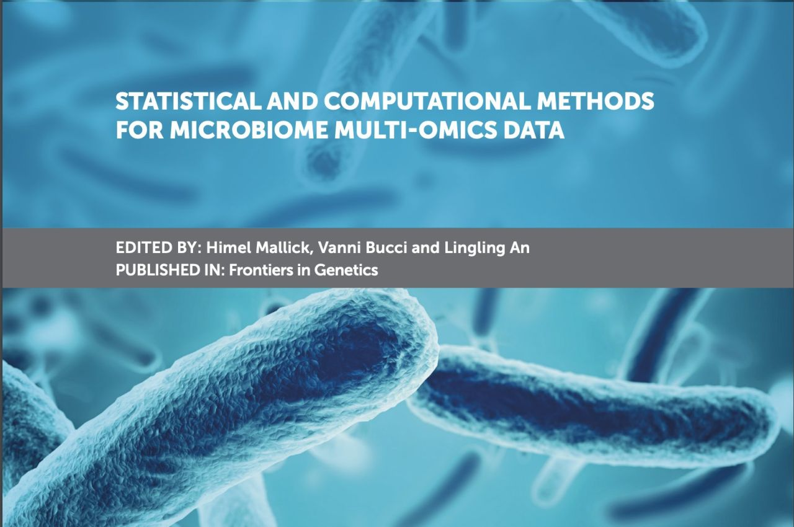

Recently, I had a chance to wrap up a [special issue](https://www.frontiersin.org/research-topics/8604/statistical-and-computational-methods-for-microbiome-multi-omics-data) at the journal [Frontiers in Genetics](https://www.frontiersin.org/). This is my first-hand experience as a lead Guest Associate Editor.

Ironically, this opportunity came to me at a time when I was exponentially busy as a postdoctoral fellow juggling research, occasional teaching and other administrative duties while also preparing my transition to a new role. I am so glad I took the chance when the Frontiers editorial office reached out to me in 2018.

The experience of (i) proposing a research topic, (ii) putting together a team of co-editors, (iii) reaching out to potential contributors, (iv) handling manuscripts on a shared basis, (v) assigning reviewers, (vi) collectively deciding the fate of the manuscripts often over multiple rounds, and (vii) finally closing the special issue with an [editorial](https://www.frontiersin.org/articles/10.3389/fgene.2020.00927/full) - it has been a long and fulfilling journey.

There are 11 articles in this research topic including an editorial, where we have curated high-quality articles published between April 2019 and July 2020 on various topics in microbiome and multi-omics data science (snapshotted below).

{fig-alt="Cover of the Frontiers in Genetics Research Topic 'Statistical and Computational Methods for Microbiome Multi-Omics Data'"}

Some of the papers have already been highly shared over the last year or so and they have together generated [\>60K](https://www.frontiersin.org/research-topics/8604/statistical-and-computational-methods-for-microbiome-multi-omics-data#impact) views within a short amount of time. Many thanks to all the authors and editorial contributors for your support.

I am looking forward to the [second round](https://www.frontiersin.org/research-topics/13026/methods-for-single-cell-and-microbiome-sequencing-data) of this Research Topic which is currently open for new research, methodology, review, and comment articles.

I hope you all have a chance to catch up on some of the progress made in the field :)
