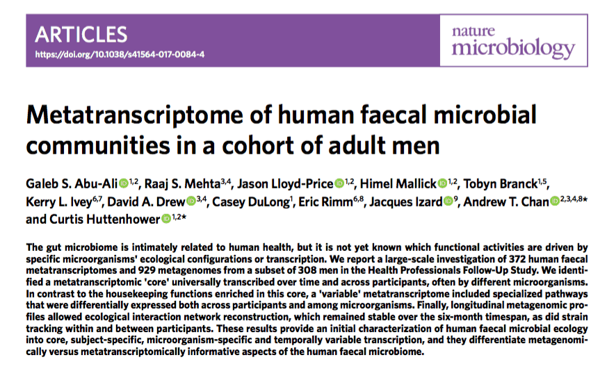

This is a repost backdated to match the original post that appeared in [Nature Research Microbiology Community](https://naturemicrobiologycommunity.nature.com/) in [January 2018](https://naturemicrobiologycommunity.nature.com/users/78027-himel-mallick/posts/29027-and-they-lived-happily-ever-after-a-microbial-fairy-tale-of-dna-and-rna). In case you are wondering, this post is a prelude to the [following publication](https://www.nature.com/articles/s41564-017-0084-4):

{fig-alt="Title and abstract of the Nature Microbiology article 'Metatranscriptome of human faecal microbial communities in a cohort of adult men'"}

I hope you enjoy reading my first ever technical blog post as much as I enjoyed writing it :)
