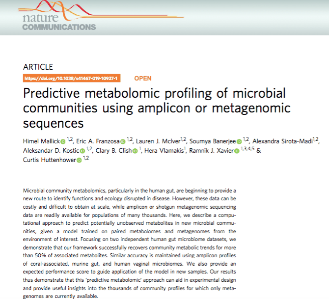

This is a repost backdated to match the original post that appeared in [Nature Research Microbiology Community](https://naturemicrobiologycommunity.nature.com/) in [July 2019](https://naturemicrobiologycommunity.nature.com/users/78027-himel-mallick/posts/49662-predicting-the-diverse-metabolic-activities-of-the-microbiome). It represents the backstory behind the [following publication](https://www.nature.com/articles/s41467-019-10927-1):

{fig-alt="Title and abstract of the Nature Communications article 'Predictive metabolomic profiling of microbial communities using amplicon or metagenomic sequences'"}

I hope you enjoy the read. Comments and feedback are always welcome :)
