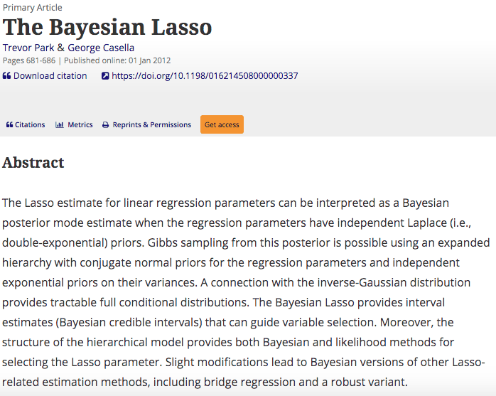

As tough as this year has been, it goes without saying that 2020 is a particularly good year to be thankful for science, which happens to be one of the many things that are often [taken for granted](https://www.linkedin.com/pulse/why-im-thankful-science-jeffrey-simmons). While similar [thankfulness posts](https://www.sciencemag.org/careers/2011/11/what-scientists-can-be-grateful-thanksgiving) have appeared [elsewhere](https://www.criver.com/eureka/good-year-be-thankful-scientists), I want to share a different take as a computational scientist.

As the title suggests, I am shamelessly borrowing idea from the so-called `most influential` series that are widespread in the popular culture. A quick Google search with `_____ that changed my life` (fill in the blank with your favorite) reveals that there is a growing list of such curated lists separately for [books](https://www.nytimes.com/2020/01/18/opinion/letters/influential-books.html), [movies](https://deadline.com/2020/05/imdb-movies-that-changed-my-life-podcast-jeffrey-wright-1202927877/), and what not but not too many dedicated to [research papers](https://arxiv.org/abs/1108.0216).

This Thanksgiving, I want to take this opportunity to express my gratitude to the authors of the [most influential paper](https://www.tandfonline.com/doi/abs/10.1198/016214508000000337) (snapshotted below) that changed my life in one way or another.

Here are the Five Ws that form the crux of the story:

**Who?**

Yours truly - A freshly minted PhD candidate of Biostatistics desperately seeking a dissertation topic that has sufficient methodological challenges but at the same time is motivated by real-world problems.

**When?**

January 2011 - just after passing the PhD qualifying examination, with no prior research experience under my belt and only a vague idea of what `Bayesian statistics` is.

**Where?**

[Department of Biostatistics, University of Alabama at Birmingham](https://www.uab.edu/soph/home/departments/biostatistics) - this is the place where I shopped for research topics across disciplines ranging from statistical genetics to clinical trials methodology and survival analysis to nonparametric inference.

**What?**

[Plot point](https://en.wikipedia.org/wiki/Plot_point) - Thanks to my advisor, I came across `The Bayesian LASSO` paper by Park and Casella which also happens to be the first paper that I read word by word multiple times.

**Why?**

[The eureka effect](https://en.wikipedia.org/wiki/Eureka_effect) - Such was the impact of this paper that I ended up choosing [Bayesian regularization](https://search.proquest.com/openview/92eec79a977d0452b818c4b4871a0bf8/1?pq-origsite=gscholar&cbl=18750&diss=y) as my dissertation topic. In hindsight, this is a decision that I am immensely proud of as it offered a right balance of theory and methods which was tricky in a predominantly applied and non-Bayesian department.

From a purely technical and objective standpoint, drawbacks and disadvantages aside, what makes the seminal work by Park and Casella (2008) an important paper in the literature is that it is the first successful (nontrivial) Bayesian hierarchical model formulation of the state-of-the-art [LASSO](https://en.wikipedia.org/wiki/Lasso_(statistics)) method and it is the first Bayesian work that successfully demonstrated the advantage of doing Bayesian inference over the frequentist LASSO.

Thanks to the authors of this paper, we now have an exciting line of research (partially inspired by the methodological advances in this paper and a few other papers that followed), motivating researchers around the world to develop scalabale and interpretable Bayesian machine learning models that are able to accurately quantify `uncertainty`, a critical component of modern data-driven decision-making in the era of big data.

{fig-alt="Title and abstract of 'The Bayesian Lasso' by Trevor Park and George Casella"}

Now it's your turn! What are the papers that you are thankful for? What is that one `most influential` paper that has significantly shaped your research life?

Featured image source: <https://journals.plos.org/plosone/article?id=10.1371/journal.pone.0120017>
