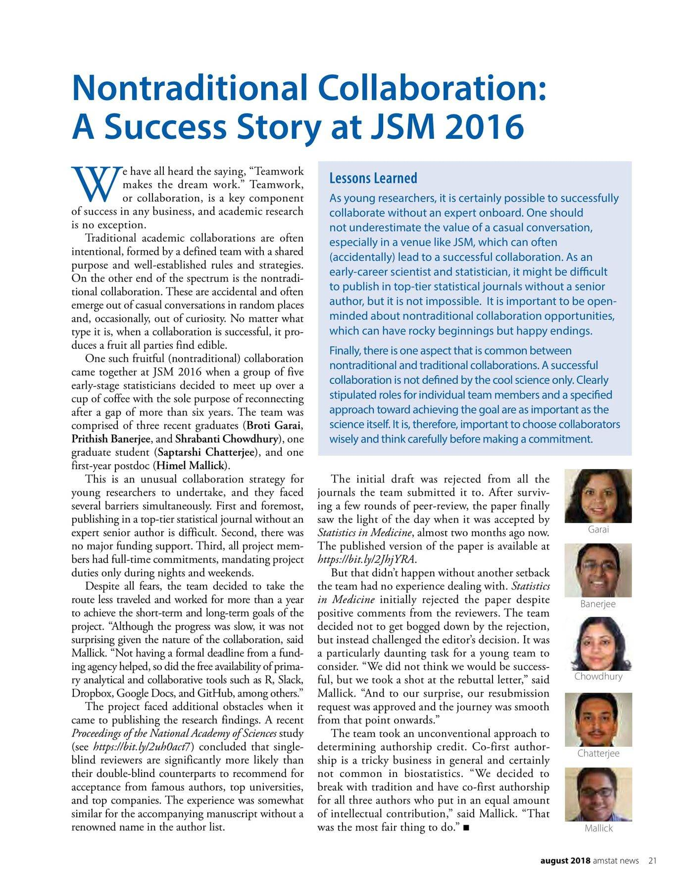

This is a repost backdated to match the original post that appeared in [AMSTAT News](https://magazine.amstat.org/) in [August 2018](https://magazine.amstat.org/blog/2018/08/01/nontraditional-collaboration/). I hope you enjoy reading it :)

{fig-alt="The AMSTAT News article 'Nontraditional Collaboration: A Success Story at JSM 2016'"}
