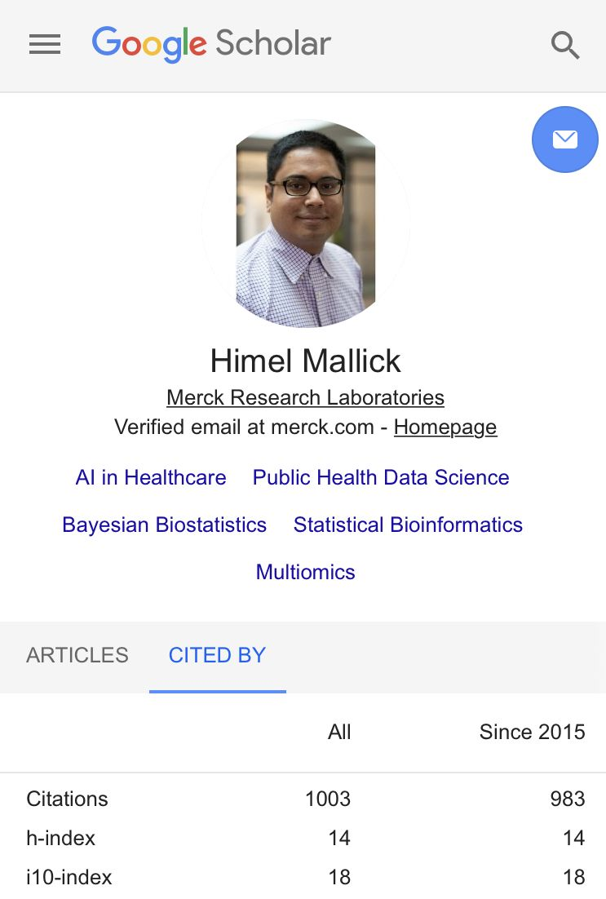

As scientists, we rarely celebrate [milestones](https://www.sciencemag.org/careers/2018/12/what-s-milestone-reflecting-life-scientist) be it a certain number of citations we have received or a certain number of impactful papers/patents we have co-authored. This is in sharp contrast to other professions where it is customary to celebrate even the tiniest bit of success in numbers. Be it how many runs a Cricketer has scored (yes I am an ardent Cricket fan!) or the number of box office successes a filmmaker has delivered.

Most of us who are in a research scientist track know very well that peer-reviewed publications constitute the bread and butter of a researcher's career. Of course, how much weight it carries varies from sector to sector, which can range from anywhere between 0% to 100%. Regardless of whether we are at the lower end of the spectrum (which is possibly true for many industry scientists) or the upper end of the spectrum (e.g. academics in research institutes), it is undeniable that much of the reputation a scientist builds is derived from their publications/patents/products and the associated impact they have on the greater scientific community.

I don't want to delve into the philosophical discussion of whether publications/patents/products are the only yardsticks to measure a scientist's success. In stead, through this post, I want to embrace the importance of celebrating such milestones (however small that might seem) that define the trajectory of a scientist's career. I truly hope that 'celebration of milestones' becomes widespread in the science community.

Personally, September 2020 marks the milestone of 1000 Google Scholar citations which I believe is an important landmark for me even though it's minuscule in the big scheme of things and I have miles to go before I sleep! This tiny feat wouldn't be possible without my excellent collaborators, colleagues, friends, and mentors and I want to thank them all from the bottom of my heart!

{fig-alt="Google Scholar profile showing 1003 citations, an h-index of 14 and an i10-index of 18"}

Featured image source: [Clipart Library](http://clipart-library.com/milestone-cliparts.html)
