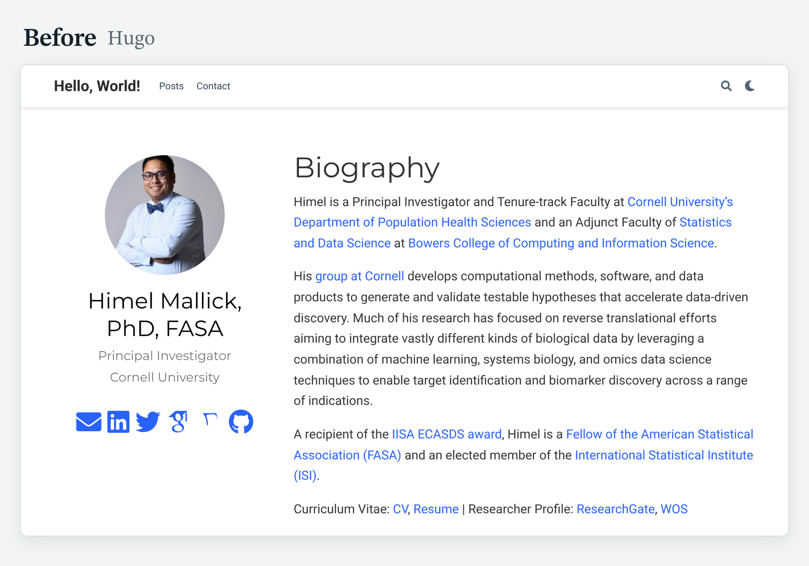

This is my first blog post as a faculty member, and my first in almost four years. The last one went up in October 2022, a few months before I started my lab at Cornell, and the blog had been quiet ever since. So for my birthday this year, I gave myself a gift that was long overdue: a complete rebuild of this site, done over one weekend with an AI assistant.

This post is the story of that weekend: why I left Hugo, how the work was divided between me and the assistant, what went wrong, and how you can reuse the result.

## Why now

{fig-alt="Before: the old home page, built with Hugo. The site title reads Hello, World! and the menu has two items."}

My old site ran on [Hugo](https://gohugo.io/) with the Academic theme, through the [blogdown](https://pkgs.rstudio.com/blogdown/) package in R. It served me well for years. By 2026, it had three problems.

**The theme was frozen in time.** My copy of the Academic theme dated from 2019 and was written for a version of Hugo from that year. The theme has since been renamed twice, and Hugo itself has moved far ahead. The site could be built only with old tools, and upgrading it meant redoing it.

**It was heavy for what it did.** The generated site had 1,078 files and weighed 48 MB. The home page fetched 16 files from third-party servers, including icon sets, a search library and a maps library, to display a biography. The menu had two items, and the site title still read "Hello, World!".

**Publishing was manual.** Every change meant building the site on my laptop and pushing the generated pages by hand. That is enough friction to postpone a small edit for months, and months became years.

I am far from the first to make this move. [Rob Hyndman](https://robjhyndman.com/hyndsight/quarto.html), [Nicola Rennie](https://nrennie.rbind.io/blog/hugo-quarto-website/) and [Robin Lovelace](https://robinlovelace.net/posts/2026-04-10-quarto-website-update/) have each described their own, and their posts make the case for Quarto well. In short, Quarto is the better tool for a site that is mostly writing, code and a CV, and that one person has to keep alive for years; Hugo remains faster and more flexible for large or highly customized sites. What I can add is an account of doing it in 2026, with an AI assistant doing most of the typing.

## What I wanted

Four things: a site that looks good, loads fast, works on every device, and takes minutes to update.

## What changed over the weekend

- **The engine.** The site is now a folder of plain text files built by [Quarto](https://quarto.org/). GitHub rebuilds and publishes it after every push, so updating the site takes three commands in a terminal.
- **The design.** One typeface, six colors, a dark mode, and a Laplace density curve under my name. The new site has about 100 files, and the home page loads its fonts and styles from the site itself.
- **The pages.** About, Experience, Papers, Software, Awards and Posts. Every published post kept its web address.
- **The CV and the resume.** Both are now built with Quarto, the same way as the site.
- **The older posts.** Several were refreshed, including the two tutorials on [automating citation metrics](../automate_citation_metrics_resume/index.qmd) and the [list of student paper awards and travel grants](../travel_grant_resource/index.qmd), which grew from 17 awards to 74.

## Who did what

I used [Claude](https://claude.com), with access to the site folder on my computer.

My part was the content and every decision: what the site says, how it reads, what stays, what goes, and when something is finished. The assistant's part was the conversion from Hugo, the styling, the build scripts and the checking.

The habit that mattered most was asking for proof. Each page was rendered and checked at phone, tablet and desktop widths. The new CV was compared word for word against the old one before I retired the old files. An assistant that reports "done" is making a claim, and the claim is cheap to verify.

## What went wrong

This is the part a tutorial leaves out.

**1. The live site showed the README.** After the first push, my domain displayed the repository's README file. GitHub Pages was still set to publish from a branch. The fix is one setting: under Settings, then Pages, the Source must be "GitHub Actions".

**2. My phone showed the desktop layout.** The new design was responsive, and my phone still displayed a shrunken desktop page. The cause had nothing to do with the site. My domain registrar was forwarding the address with a "masked" redirect, which wraps the site in a frame. Replacing it with proper DNS records for GitHub Pages solved it, and the security certificate arrived after a short wait.

**3. The images lost quality.** During the move, the assistant had resized and recompressed the pictures in my posts. I noticed that some looked soft. The fix was to restore 27 originals from the archived copy of the old site and to re-save six more from their sources. Keep your originals.

**4. My CV disappeared from the internet.** Quarto deletes the old PDF at the start of a build. My first build on my own computer failed, and the PDF behind the public CV link was gone until I restored it from the archive. If a public link points to a file that your build produces, a failed build takes it down.

**5. The link preview cut my head off.** When I shared the new site, the preview showed my shirt. Social networks crop preview images to a wide rectangle, and my home page was offering them a tall portrait. A dedicated wide image for link previews fixed it.

**6. The assistant edited too much.** Asked to refresh an old post, it rewrote my text. Asked to update a chart, it redesigned the chart. In both cases I had it restore my original and limit itself to what I had asked for. An assistant that edits fast also edits freely, and it helps to say at the start which parts are yours and must stay as they are.

**7. Google Scholar turned the assistant away.** The citation counts could not be fetched from the assistant's cloud workspace. The script therefore runs on my own computer, saves the numbers it receives, and reuses them on days when Google Scholar declines to answer.

## What I would tell a colleague

- **Keep an archive of the old site.** Several of the problems above were solved from it.
- **Review every change before it goes live.** A local preview takes seconds.
- **Protect your own voice.** Let the assistant handle the machinery, and keep the writing yours.
- **Ask for proof.** A check that fluent writing cannot get around is the best instruction you can give.

## Use it yourself

The source of this site is a [public template on GitHub](https://github.com/himelmallick/himelmallick.github.io). The README explains how to make it yours, with step-by-step prompts for doing so with Claude: replacing the content, changing the look, bringing old posts along, checking the result and publishing.

And yes, since every piece of text is now allegedly AI-written: the assistant helped me draft this post too. The weekend, the decisions and the mistakes are mine.

Feedback and pull requests are welcome :)
