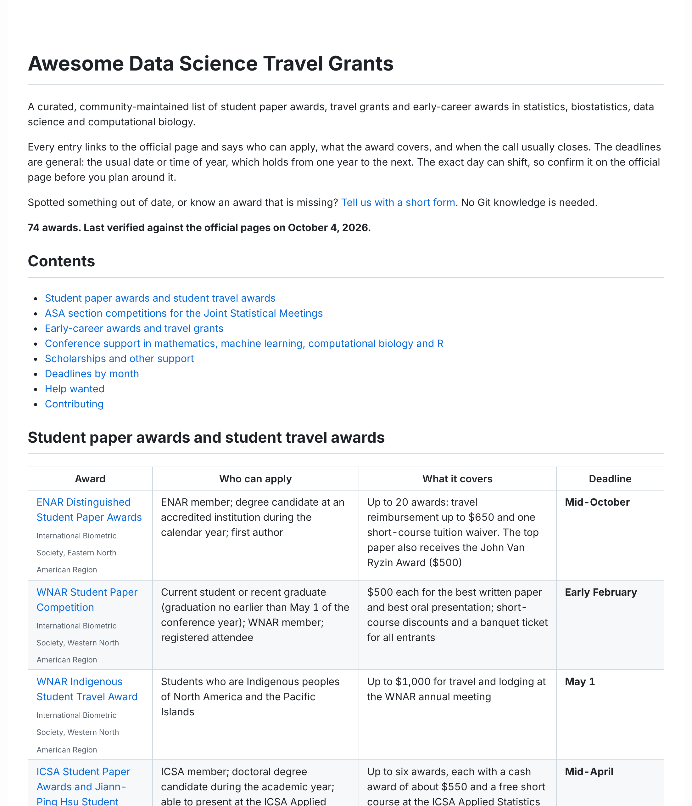

*Updated on October 4, 2026. The list has been rebuilt: every entry was checked against its official page, it has grown from 17 awards to 74, and there are now three ways to contribute, including a short form that needs no Git.*

This post is motivated by the growing list of `awesome` public repositories that curate a list of resources dedicated to a specific topic (such as [this](https://github.com/dangkhoasdc/awesome-ai-residency), [this](https://github.com/academic/awesome-datascience), and [this](https://github.com/josephmisiti/awesome-machine-learning), among others).

As a graduate student, I often struggled to find such a centralized resource, especially when it comes to student paper awards and travel grants, geared towards data science graduate students and postdocs (broadly defined). On the surface, these awards help you save a few hundred dollars of registration and other out-of-pocket travel expenses but they are also worth the effort to go the extra mile in getting a nice gold star for a CV.

Both the [ASA](https://www.amstat.org/your-career/student-paper-competitions) and the [IMS](https://imstat.org/ims-awards/) have already done a great job in gathering a subset of these opportunities in their respective websites. However, it has been difficult to quickly sort through the information with respect to several desirable aspects such as eligibility, deadline, coverage, and scope, because the details are spread across many separate websites.

Based on these factors, I have assembled this [public repository](https://github.com/himelmallick/awesome_datascience_travel_grants) (the top of the list is snapshotted below) as an attempt to aggregate and synthesize information related to statistics/biostatistics/data science travel awards and grants with a special emphasis on those geared towards early career researchers.

{fig-alt="The top of the 'Awesome Data Science Travel Grants' list: 74 awards, last verified on October 4, 2026, followed by the first rows of the table of student paper awards"}

## What is new in 2026

The first version of this list had 17 entries and was last touched in 2021. Award pages move and deadlines shift every year, so by 2026 most of its entries pointed to an old page or an old date. The new version starts over:

- **74 awards in five groups:** student paper awards and student travel awards (19), the ASA section competitions for JSM (20), early-career awards and travel grants (12), conference support in mathematics, machine learning, computational biology and R (17), and scholarships and other support (6).
- **Three facts for every award:** who can apply, what it covers, and when the call usually closes. The deadlines are general (for example "November 15" or "mid-October"), so the list stays useful from one year to the next.
- **A month-by-month calendar** of deadlines at the bottom.
- **The date of the last check**, so you know how fresh the information is.

If you saved dates from the 2020 version, please check your calendar. Several have moved:

- The ENAR Distinguished Student Paper Awards now close on **October 15**.
- Most ASA section competitions now close on **November 15**, a student may enter at most two sections, and winners hear by January 15.
- The WNAR student paper competition now closes in **early February**.
- The ICSA student paper awards now close in **mid-April**.
- The IMS Lawrence D. Brown Ph.D. Student Award now closes on **July 1**.

The refresh itself was done with [Claude](https://claude.com), which checked each award against its official page and recorded the date of the check. I mention it because it changes what is realistic for a volunteer-run list: a full re-check of every entry is now an evening's work, so the list can be kept current once a year.

## How to contribute

While this is not intended to be a comprehensive overview of such opportunities, I would like this public repository to be an ongoing community effort with the hope that it serves the early-career data science community at large. There are now three ways to help, from quickest to most hands-on:

1. **Fill in a short form.** [Suggest an award](https://github.com/himelmallick/awesome_datascience_travel_grants/issues/new?template=new-award.yml) or [report a correction](https://github.com/himelmallick/awesome_datascience_travel_grants/issues/new?template=correction.yml). No Git knowledge is needed.
2. **Edit the table in your browser.** The whole list lives in one spreadsheet-like file, [`awards.csv`](https://github.com/himelmallick/awesome_datascience_travel_grants/blob/master/awards.csv). Click the pencil icon, change or add a row, and GitHub walks you through the rest.
3. **Open a pull request** the usual way.

Any of the following is welcome from the community members:

- New information you'd like to add (such as a new award not already listed)
- Inaccuracies in the content (e.g. deadline, eligibility, etc.)
- Information gaps in the content that need more details to be complete (e.g. broken links)
- Awards from societies outside North America, which the list barely covers today

The repository also has a "Help wanted" section with leads that could not be confirmed on an official page. If you know one of those awards, that is the most useful place to start.

I look forward to your suggestions and pull requests :)

Featured image source: [perforce](https://www.perforce.com/blog/vcs/why-did-google-choose-centralized-repository)
