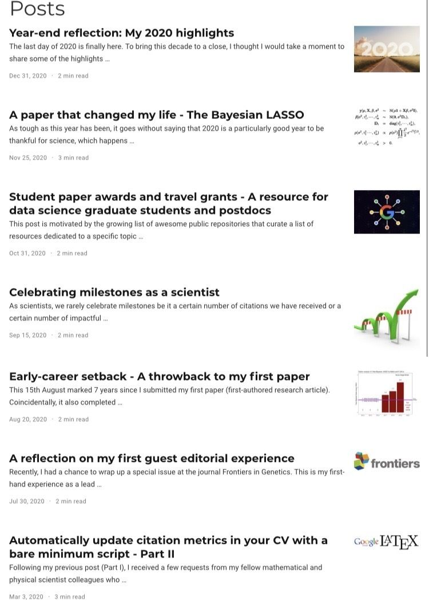
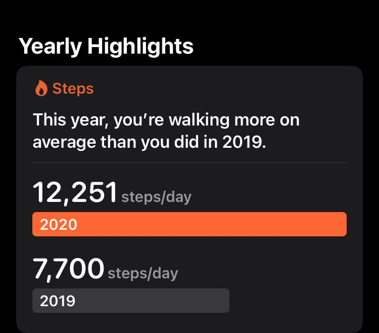
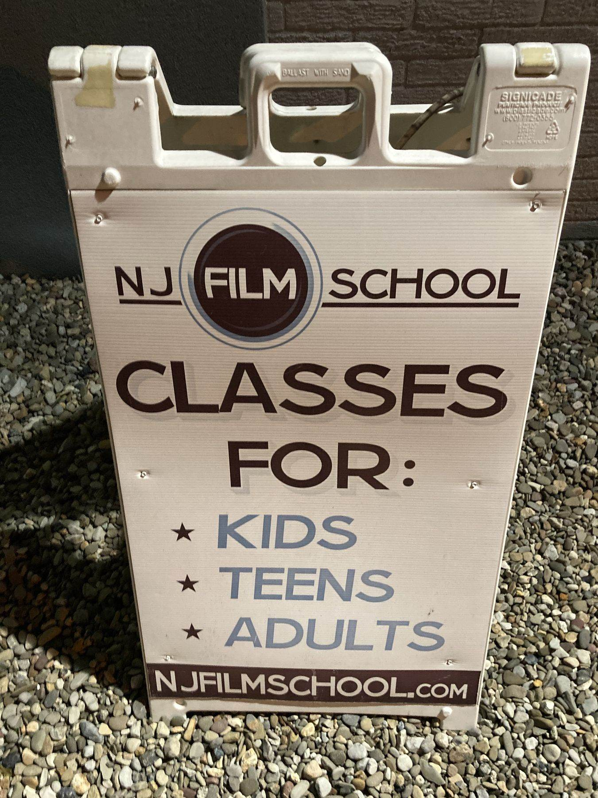
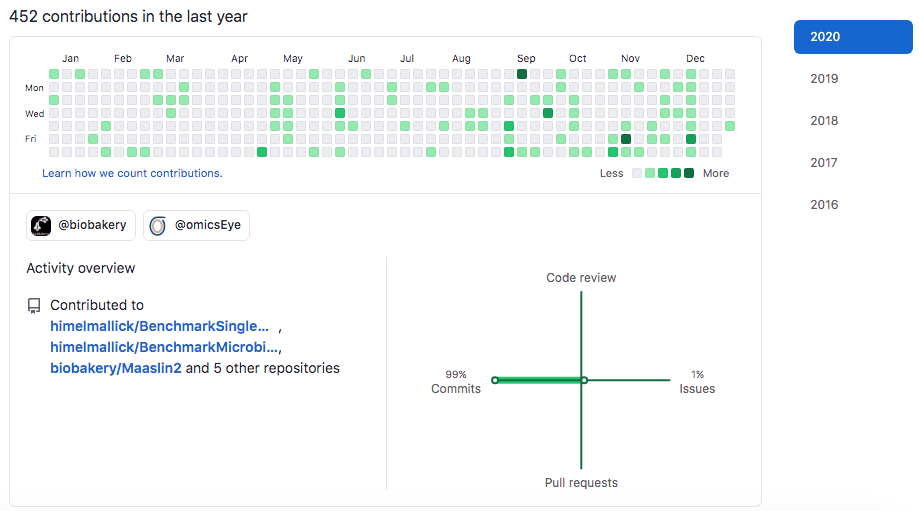
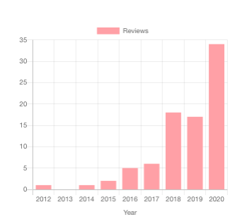

The last day of 2020 is finally here. To bring this decade to a close, I thought I would take a moment to share some of the highlights from this year in the form of pictures and anecdotes.

As much as I would love to remember this year as a year of `setbacks and bottlenecks`, in retrospect, it has been packed with some very surprising yet noteworthy moments.

On a personal level, 2020 has been a year of many firsts, much as has been the case for the society in general where we have together achieved incredible things as a community despite challenging circumstances. From delivering vaccines in record time to abiding by the social distancing guidelines to adjusting to the `new normal`, we have come a stunningly long way in a short period of time, which I believe, prepares us well for a pandemic-proof future in 2021 and beyond.

Here are some things that went surprisingly well during the entire thriving process:

## New year resolutions

One of my new year resolutions in 2020 was to write at least one piece of writing every month (technical or non-technical). This seemed like a lofty goal at the outset but I am glad that I was able to break this seemingly hard-to-attain goal into manageable chunks to make it a reality. In my mind, this was a monumental personal milestone as it allowed me to build a decent writing habit which has been difficult historically.

{fig-alt="List of the blog posts published in 2020"}

## \>10000 steps per day

Another seemingly unattainable habit (based on past experiences) was consistently hitting an average \>10,000 steps a day for an extended period of time (i.e. more than a few weeks or months), which I was able to achieve despite the almost year round lockdown. Considering all the obstacles that stood in the way this year, it was a truly transformative experience to start 2021 on a `lighter` note!

{fig-alt="Step counter summary: 12,251 steps per day in 2020 compared with 7,700 in 2019"}

## Getting back into creative writing

Towards the end of the year, I was fortunate to enroll in a `screenwriting` class. Among other things, this was my best chance at getting back into creative writing. As a result of this experience, I was able to write a few short scripts in addition to a few amateur poems which was enough to eventually claw my way to get my writer's groove back :)

{fig-alt="Sidewalk sign advertising NJ Film School classes"}

## Personal commit record

In the meantime, almost accidentally, I broke my own record of GitHub commits, which was more than all the previous years combined. I couldn't be more happy about this `unexpected` milestone!

{fig-alt="GitHub contribution chart showing 452 contributions in the last year"}

## Personal peer-review record

By the same token, I couldn't be more appreciative of the opportunity to give back to the scientific community through voluntary contributions in the form of peer-review activities. Consequently, I was able to break my own record of [Publons-verified peer-reviews](https://publons.com/researcher/1190507/himel-mallick/metrics/), which was again `accidentally` more than all previous years.

{fig-alt="Bar chart of peer reviews per year, rising to 34 in 2020"}

Apart from these, there have been a few `first-of-its-kind` professional highlights this year as well:

- Completed my first internship as a mentor
- Edited my first [special issue](https://himelmallick.github.io/post/guest_editing_reflection/) as a lead editor
- Published my first [Bioconductor package](https://www.bioconductor.org/packages/release/bioc/html/Maaslin2.html)
- Delivered my first [keynote presentation](https://twitter.com/Mallick_Himel/status/1260271590320885764)
- Organized my first [JSM invited session](https://ww2.amstat.org/meetings/jsm/2021/invitedsessions.cfm) (scheduled for JSM 2021)

With that note, I would love to hear your highlights from the year, so be sure to leave a comment :)

Wishing you and yours a safe, healthy, and prosperous new year! Onwards and upwards!

Featured image source: <https://www.the-scientist.com/news-opinion/what-to-expect-in-the-publishing-world-in-2020--66882>
